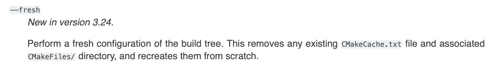

# CMakeGuidelines
Collection of useful cmake tips.

### 12/06/2023 Superfluous generator expressions
All that `$<BUILD_INTERFACE:…>` and `$<INSTALL_INTERFACE:…>` stuff is only needed for libraries you are installing. Do not copy-paste that stuff onto your executable targets. That includes tests. Even if you install an executable you don’t need these generator expressions. Installed executables have no notion of include directories so you can use the much simpler form of target_include_directories which omits these.

### 05/18/2023 Fake targets and namespacing
This code will configure, compile, and link without errors:
target_link_library(my-library PUBLIC this-target-absolute-does-not-exist)
If you provide a link library without a namespace (in other words there is no :: in the name) CMake will first try to find a corresponding CMake target with that name. If it can’t find a CMake target, it will instead just add -lthis-target-absolute-does-not-exist to the linker line because that may in fact really be a library you have somewhere on your machine. In practice this means that a subtle misspelling of your target name can easily result in linker errors.
Conversely, if you use a namespaced target name and CMake cannot find that target, configuration fails. That means you find and fix these bugs much faster. As library authors this means adding a namespace to the targets in your export set and also providing an ALIAS target so that anyone consuming your library via add_subdirectory can use that namespaced target name as well.
Discussed in [this talk](https://www.youtube.com/watch?v=gN17Q13WLXM)

### 11/04/2022 No build type
The lack of a build type is not a debug build.
The `CMAKE_BUILD_TYPE` variable can have values like `Debug` or `Release` but it can also be blank. When it’s blank, CMake will not add flags like `-g`. It will simply omit those flags and you’ll end up using more of your compiler’s defaults.
While the lack of a build type isn’t necessary a problem and should never break your build, I still recommend always setting a build type so you know what you’re getting.

Notably, `CMAKE_BUILD_TYPE=None` is used by debian to inject build flags for packages.

### 11/01/2022 Clean rebuilds
CMake 3.24 adds a new `--fresh` flag which simplifies the process of doing clean rebuilds. This is the kind of feature you can use locally if you have 3.24 installed even if you’re working on a project whose minimum version is lower.  
https://cmake.org/cmake/help/v3.24/manual/cmake.1.html#options  


### 10/27/2022 Prefer linking over `Package_INCLUDE_DIRS`
Always prefer linking to a 3rd party target over using `${Package_INCLUDE_DIRS}`.
1. The target based approach is more generic and extensible. If a library author adds a new include directory or changes from a header-only to compiled library, you don’t care. Everything just keeps working.
1. The variable-based solution is being phased out. Don’t be surprised if a variable-based workflow which used to work silently breaks since that variable is now empty after a major update to a library. CMake will let you dereference empty variables so it’s hard to know when this happens.
1. CMake will error out if a target is missing or has the wrong name. Unlike the above problem, targets give you much stronger guarantees when things go wrong. If a target does not exist or you just spelled it wrong, configuration halts and you’re forced to fix it.
1. Using targets avoids the extra hassle of using the `$<BUILD_INTERFACE>` generator expression in your `target_include_directories` call.
1. It’s simply less code to write. Target names tend to be shorter than variable names but beyond that, you often have to use the variable based approach in at least two places, once for include dirs and once for link libraries.  Linking to a target is only needed once and you’re done.

### 10/20/2022 Project Description
The `project()` call includes many optional arguments including `DESCRIPTION` which does what you’d expect. It lets you specify a short string that describes the purpose of the project. This is useful for project like RSL which are an abbreviation for something longer so we put that whole name in the `DESCRIPTION` field. This also has the nice property of automatically appearing in your Doxygen docs since the `doxygen_add_docs` function checks the `PROJECT_DESCRIPTION` variable.


### 09/30/2022 Non-standalone projects
Only add `cmake_minimum_required` and `project` calls if you plan on building that directory as a standalone project. There are valid reasons to do this within a project but generally speaking if you write `add_subdirectory(some_dir)` then you don’t need to include those two calls inside some_dir/CMakeLists.txt. At best this code is just a no-op. At worst it causes subtle bugs due to how `PROJECT_` prefixed variables and `CMAKE_` prefixed variables behave. (edited) 

### 09/06/2022 Stop quoting paths!
I was given old “wisdom” that if you dereference a variable that contains a path (for example, `CMAKE_SOURCE_DIR`) and that path contains a space, that one variable will actually expand into two arguments which are both broken paths. **This is not true**. Clone a project into a directory with a space in it and nothing will break. It’s totally fine and not something you need to defend against.
For example,
```
install(DIRECTORY include/
        DESTINATION ${CMAKE_INSTALL_INCLUDEDIR}
        COMPONENT mylib_headers)
```
There is no need to put quotes around `${CMAKE_INSTALL_INCLUDEDIR}`. I’d go ever farther to actively recommend against adding those quotes because it reinforces that old school paranoia and makes it harder to know when quotes are truly necessary. When I see quotes in CMake I expect that’s because the quotes are provably required because in some instances they are actually very important.

### 08/29/2022 Use trailing forward slashes with intent
Trailing slashes on paths are sometimes very meaningful. Take the two snippets
```
install(DIRECTORY include
        DESTINATION .
        COMPONENT libname_headers)
```
```
install(DIRECTORY include/
        DESTINATION ${CMAKE_INSTALL_INCLUDEDIR}
        COMPONENT libname_headers)
```
The first snippet installs the `include` directory *including a directory named* `include`.
The second snippets installs the contents of the `include` directory but not the `include` directory itself. Both examples will do what you want the latter is preferable since it gives you more control over the directory into which your headers get installed. For all I know you want to install your headers into a directory named `headers` instead of `include` and the 2nd form gives you (and those installing your library) that control.
Pay attention to those trailing backslahes next time you’re debugging install code!

### 08/26/2022 Enable LTO (link-time optimization)
Use `CMAKE_INTERPROCEDURAL_OPTIMIZATION` to easily enable link-time optimization (LTO) for a project. On the command line this looks like `-DCMAKE_INTERPROCEDURAL_OPTIMIZATION=ON`. Hardcoding this for your project looks like `set(CMAKE_INTERPROCEDURAL_OPTIMIZATION ON)`. CMake knows whether or not your compiler supports LTO so nothing should fail if your compiler does not support it.
https://cmake.org/cmake/help/latest/variable/CMAKE_INTERPROCEDURAL_OPTIMIZATION.html

### 08/24/2022 `list(APPEND`
Use `list(APPEND` to add elements to a list like so
```
set(MY_VARIABLE element1)
...
list(APPEND MY_VARIABLE element2 element3)
```
over the more verbose alternative
```
set(MY_VARIABLE element1)
...
set(MY_VARIABLE ${MY_VARIABLE} element2 element3)
```
Don’t repeat yourself if you don’t need to!
I’ll also briefly mention `list(PREPEND` if you need to prepend instead of append to a list. `list` has tons of options for manipulating lists that are all better than trying to re-implement it by hand with lots of set calls.

### 08/15/2022 `GenerateExportHeader`
Use the [GenerateExportHeader](https://cmake.org/cmake/help/latest/module/GenerateExportHeader.html) module to generate a header that defines macros for symbol export. GCC and Clang export all symbols by default but if you want better control over what symbols are public in your .so, you need to use non-portable compile attributes to specify that. This CMake module automates a lot of the busy work required to generate those macros and does so in a way that works on all platforms, including Windows.
I’ve used this before and it’s not too hard to get set up with. I’d definitely recommend this if you’re hardcore about not letter users depend on implementation details.

### 08/11/2022 `CMAKE_` vs `PROJECT_`

When two variables have the same name but one has a `CMAKE_` prefix and the other a `PROJECT_` prefix, the difference is that the `CMAKE_` prefixed version refers to the top level project. The `PROJECT_` prefixed version refers to the whatever project is currently being configured. They often mean the same thing but they’re different when you have projects inside projects like through the use of git submodules or using `FetchContent` to bring it outside projects.
For example, `PROJECT_SOURCE_DIR` is the root of the project currently being configured. If you’re writing a library, this is usually what you should be using since you can be certain that it will always refer to the root of your library even if someone takes your project and puts it inside their project. `CMAKE_SOURCE_DIR` refers to the top level CMakeListst.xt file that was passed to `cmake`. When you run `cmake -S. -B build` you’re saying the current directory is the `CMAKE_SOURCE_DIR`. Within that CMakeLists.txt you can add as many outside projects as you like and each outside project will have a different `PROJECT_SOURCE_DIR` but `CMAKE_SOURCE_DIR` will only ever refer to the same directory no matter where it’s used.

### 08/10/2022 `endif` conditional

Do this
```
if(SOME_CONDITION)
   ...
endif()
```
not this
```
if(SOME_CONDITION)
   ...
endif(SOME_CONDITION)
```
Surprisingly the 2nd form is valid and behaves the same as the first. There’s no good reason to be repeating yourself in the endif call. It’s entirely unnecessary and just makes the code harder to read and maintain.
